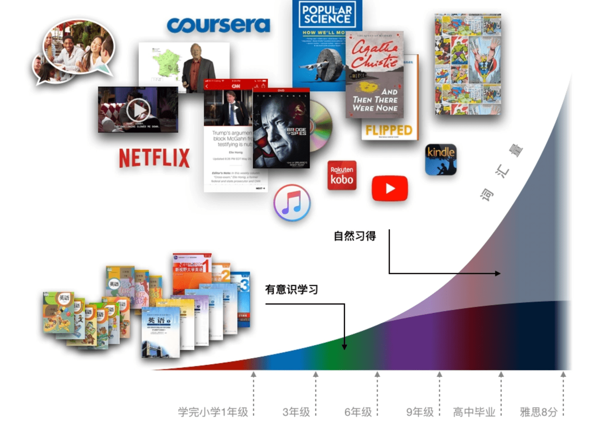
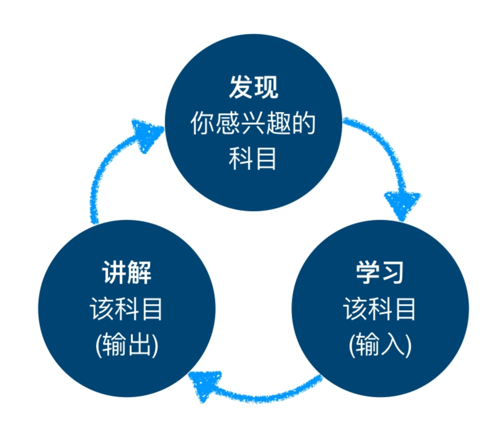

# 流利之路


https://yingyuyingxiong.teachable.com/p/path-to-fluency



《流利之路》课程旨在帮助程度相当于中国高中、大学的英语学习者达摆脱以考试为纲的“传统”学习的束缚，通过大量可理解输入和自然习得法真实地提高综合英语能力，达到真正的流利程度。课程会教你如何发现自己感兴趣的主题，如何获得真实的英语材料，以及如何操练自己的口语和写作。通过这门课程，学习者会将英语提高到的接近母语的流利程度，并在此过程中对科学、技术、历史、政治和艺术等广泛的学科领域获得深入的知识。


## 1 介绍

### 1.1 什么才是“流利”

> 流利：能够理解真实的英文音频（暂时的定义）

流利：通过一种新的语言来重新构造这个世界的认识。

### 1.2 区分语言“习得”和语言“学习”

要知道如何达到流利，需要先理解第二语言习得的一些理论。

语言**学习**和语言**习得**的差异：

- 语言习得的主要方法：通过可理解输入。
- 语言习得就是一个人的自然的，无意识的学到的语言。
- 语言习得的例子：读一本英文小说、读一篇英文新闻、看一部英文电影、看一个用英文录制的视频、听一段英文播客(Podcast)、用自然的方式与英文是母语的人交流。
- 语言学习的例子：学习某一个单词在字典上面的所有意思、背一个单词表、完成一个雅思考试的模拟试卷。

如何搭配语言的学习和习得来达到目标。

### 1.3 将“学习”与“习得”结合起来

当英语学习到达一定阶段以后，我们不可能只通过一套教材就完成的英语学习。我们需要通过自然习得来进行更高阶段的学习。

### 1.4 自然习得的总体方略

可以通过先发现自己感兴趣的科目，然后通过英语材料来学习自己感兴趣的科目。

内容依托学习法（CBI）的三个步骤如下

通过不断重复**发现:arrow_right:学习:arrow_right:讲解**这三个步骤，可以全面的提升自己的英语。

### 1.4.1 习得的第一步 - 发现感兴趣的学科

发现的感兴趣的科目必须满足一下两个条件：

- 足够有趣
- 英文材料足够多

发现自己感兴趣的科目的方法：

- 在视频网站搜索以下关键词
    - documentaries-纪录片
    - speech-演讲
    - course-课程
    - lecture-讲义
- 在[Coursera](https://www.coursera.org/)上面寻找自己感兴趣的课程
- 在一些影评网站上面寻找自己感兴趣的电影电视剧
    - [Rotten Tomatoes](https://www.rottentomatoes.com/)

### 1.4.2 习得的第二步 - 获取输入

通过视频、书籍和体验等获取输入。

### 1.4.3 习得的第三步 - 产生输出

与别人交流、写文章等进行输出。

### 1.5 有意识的学习

> 要衡量自己的英语学习水平可以通过参加类似雅思和托福的考试

除了自然习得以外，应该进行一些有意识的学习。

聘请辅导老师、参加当地语言学校的学习课程（中国的语言培训机构：美联英语、英孚英语）、留学（Study abroad）和工作假期（Working holiday）等是提高英语水平的好办法。

避免学习压力（情感过滤），学习压力会降低学习英语的效率。

如何降低情感过滤（学习压力）:持续关注自己感兴趣主题（自然习得）。

虽然通过自然习得的方法要显著的提高自己的语言水平需要很长的时间，但是这是提高流利程度的最好的方法。

不要被一些规矩束缚了（如English only）,适合自己才是最好的。

享受学习的过程，慢慢来。

把有意识的学习和自然习得的方法结合起来达到最好的学习效果。

### 1.6 从语言学习社区获取灵感

- 语言学习博客和网络视频
  - 播客
    - 播客APP
      - Podcasts(IOS)
      - Pocket Casts(IOS+Android)
    - 关键词：学习外语、学习英文、Language Learning、Learn for languages
    - 博客节目推荐：ACTUAL FLUENCY-kris Broholm
  - Youtube
    - 关键词：语言学习
- 多语言人士(Polyglot)集会
  - [POLYGLOT GATHERING](https://www.polyglotgathering.com/)
  - [LangFest Montreal](https://montreal.langfest.org/)
  - [Polyglot Conference](https://polyglotconference.com/)
- 找到自己的路
  - 对别人的建议持保留态度，不必全盘接受。
  - 语言学习没有什么硬性规定，不用搞教条主义。
  - 找到最适合自己的方法。

## 2 读（资源）

### 2.1 不同的阅读方法

通过阅读的方式进行分类

- 泛读 vs 精读
- 按顺序 vs 不按顺序
- 默读 vs 朗读

> [Speechling](https://speechling.com/)(帮助你纠正发音)
>
> [Libby](https://www.overdrive.com/apps/libby)(有声书)
>
> [轻听英语](https://qtyy.cn/)(有声书)
>
> [喜马拉雅](https://www.ximalaya.com/)(有声书)

### 2.2 发现你最喜欢的书

- 线上

  - [Goodreads](https://www.goodreads.com/)

  - [豆瓣读书](https://book.douban.com/)
  - Twitter(标签：#books)
  - 微博(标签：#英文书#)
  - 知乎（关键词：书单）

- 参加当地外国人组织的读书俱乐部

  - [Meetup](https://www.meetup.com/)
  - 大学或者图书馆的公告板

### 2.3 获取英文电子书

### 2.4 获取电子杂志和报纸

### 2.5 在网上阅读英文新闻和文章

### 2.6 从社交网站中获取资料

### 2.7 阅读漫画

### 2.8 通过网购获得纸书

### 2.9 使用面向学习者的资源

## 3 读（技巧）

## 4 听

## 5 体验

## 6 说

## 7 写

